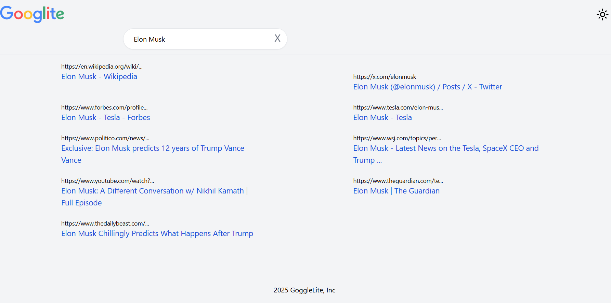

# 🌐 Гуго Лайт — мини-поисковик (pet-project)

Простой, лёгкий и шустренький поисковик, созданный ради практики.
Клон Google, но в версии “лайт”. Только самое нужное — строка поиска и результаты. Ничего лишнего.

---

## ✨ Что умеет

- 🔎 Делает поиск по интернету (через Serper API)

- ⚡ Умно задерживает ввод, чтобы не спамить API

- 🎨 Имеет светлую/тёмную тему

- 📱 Адаптивный интерфейс

## 🛠 Технологии

- React

- TailwindCSS

- Context API

- useDebounce

- Serper API

## 🧰 Запуск
npm install
npm run dev

### Создать .env:

VITE_APP_API_KEY=b9ee28a00b1610dad0cd665270f367a68305cfb4

# Пет-проект ради развития скиллов 👾